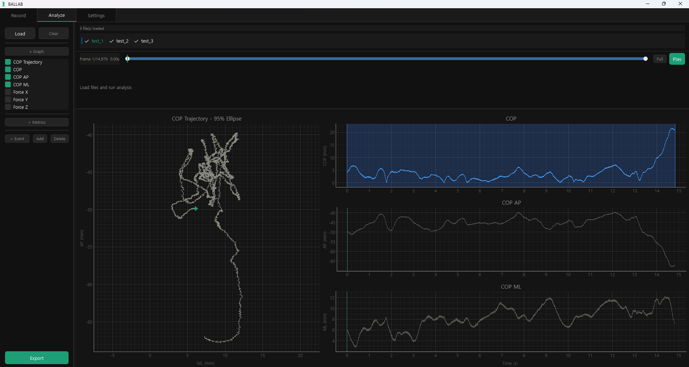
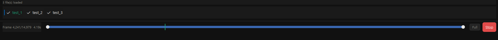
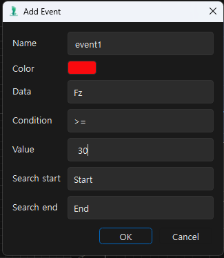
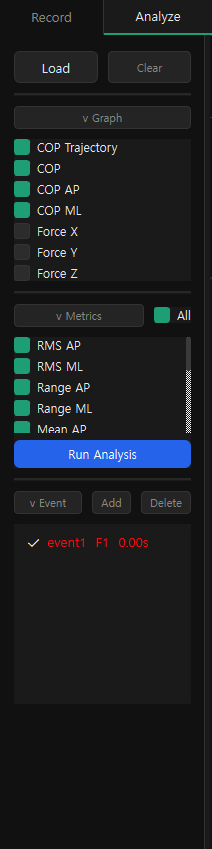
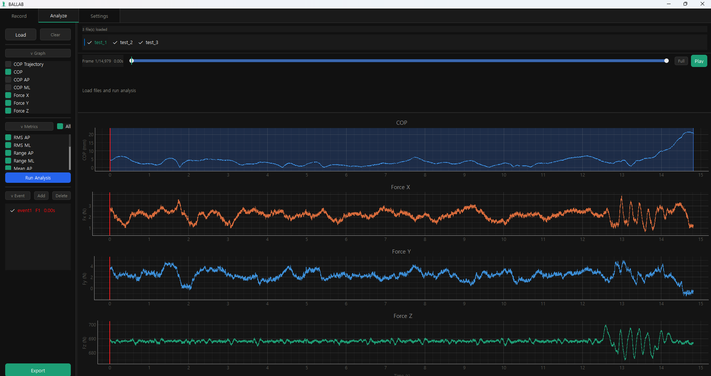
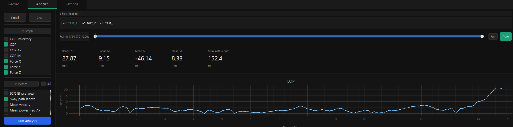
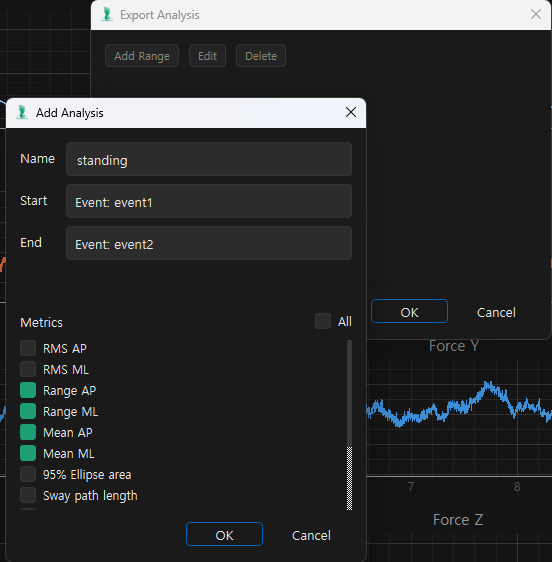
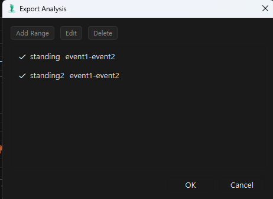
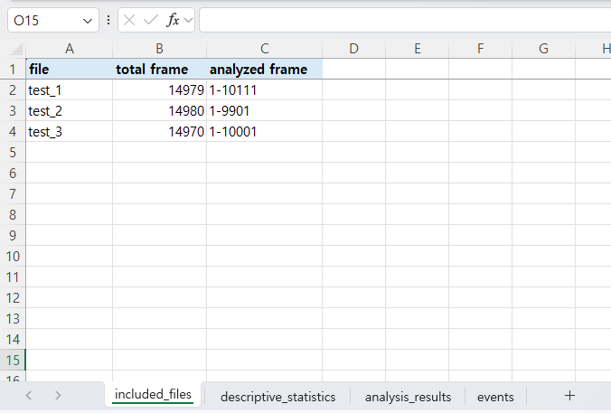
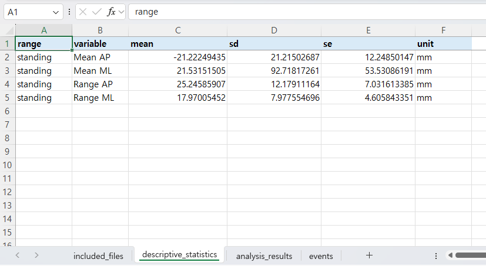

# BALLAB Force Plate Tools

Desktop software for recording, replaying, visualizing, and analyzing force plate data for balance and center-of-pressure (COP) research workflows.

BALLAB Force Plate Tools is built for laboratory use with AMTI-style force plate signals and QTM streaming. The application separates live recording from offline analysis so recorded trials can be reviewed, compared, marked with events, analyzed, and exported without including raw research data in the repository.

## Visual Walkthrough

The screenshots below explain the main analysis workflow for someone seeing the project for the first time. Screenshot data should be synthetic, demo, or anonymized.

### 1. Load Trials and Review COP Motion



The Analyze tab is the offline workspace for saved force plate trials. Users load one or more CSV files, select a trial from the file strip, and inspect COP movement before running metrics.

This view highlights:

- Multiple loaded trials with checkboxes for batch analysis
- A replay timeline for the current trial
- COP trajectory, COP magnitude, COP AP, and COP ML plots
- Graph controls for showing or hiding signal groups

### 2. Replay the Selected Trial



The replay bar lets users move through the current file frame by frame or press Play to inspect trial quality over time. The selected file is highlighted while other loaded files remain available for comparison.

This view highlights:

- Current frame and elapsed time
- Trial selector for switching files
- Full-range reset
- Playback control for the current displayed file

### 3. Add Event Markers



Events mark meaningful moments in the trial, such as a force threshold crossing or a time-based point. Events can be used as visual markers and as boundaries for later export ranges.

This view highlights:

- Event name and marker color
- Source signal selection, such as Fz or Time
- Threshold condition setup
- Search range controls

### 4. Choose Graphs, Metrics, and Events



The left sidebar keeps analysis controls close to the plots. Users can choose which graphs are visible, select metrics, run analysis, and review detected events.

This view highlights:

- Collapsible Graph, Metrics, and Event sections
- COP and force signal visibility toggles
- Metric selection before running analysis
- Event list for reviewing or deleting markers

### 5. Inspect Force Signals



Force X, Force Y, and Force Z can be displayed alongside COP data. This helps users check whether force behavior matches the COP movement and event timing.

This view highlights:

- COP plot synchronized with force plots
- Force X, Force Y, and Force Z traces
- Shared time axis for visual comparison
- Event marker overlay across visible time-series plots

### 6. Review Balance Metrics



After analysis, selected COP metrics are shown as compact result cards. This gives quick feedback before exporting a full workbook.

This view highlights:

- RMS, range, ellipse, path length, velocity, and frequency metrics
- Units displayed with each result
- Current analyzed file and selected time range
- Horizontally scrollable result cards

### 7. Define Event-Based Export Ranges





Event markers can define analysis windows. For example, a user can mark the start and end of a standing phase, then export only metrics from that window.

This view highlights:

- Time-based event creation
- Event-to-event analysis range setup
- Per-range metric selection
- Reusable named analysis ranges

### 8. Export Results to Excel





Exported workbooks summarize the included files, per-range descriptive statistics, individual metric results, and event markers. This keeps raw trial data out of the repository while preserving analysis outputs locally.

This view highlights:

- Included file summary
- Analyzed frame ranges
- Descriptive statistics by analysis range and metric
- Separate workbook sheets for files, statistics, results, and events

No participant data, real trial identifiers, private file paths, or lab records should be visible in screenshots.

## Current Features

- Live force plate recording through QTM connection.
- Record tab focused on data collection and saving recorded trials to CSV.
- Analyze tab for loading recorded CSV files and replaying the selected trial.
- COP visualization:
  - COP trajectory
  - COP time series
  - COP AP and COP ML traces
  - 95% ellipse visualization for analyzed data
- Force visualization in Analyze:
  - Force X
  - Force Y
  - Force Z
- Selectable graph panels with collapsible Graph, Metrics, and Event sections.
- Analysis range selection using a time slider.
- Metric selection and analysis execution for checked files.
- Event detection and event marker visualization.
- Excel export for analysis results, descriptive statistics, included files, and events.
- Settings for live axis sign correction and analysis filter options.
- Windows build scripts and PyInstaller configuration.

## Planned Features

These items are planned or reserved and should not be treated as completed functionality:

- More formal validation against known force plate datasets.
- Example screenshots using synthetic or anonymized data.
- User documentation for the analysis metrics.
- Expanded export templates for reporting.
- Additional hardware connection presets.
- Automated tests for CSV parsing, event detection, and metric calculations.
- Optional sample dataset generated from synthetic data only.

## Project Structure

```text
.
|-- main.py                 # Application entry point
|-- core/                   # Data processing, metrics, QTM client, axis settings
|-- ui/                     # PyQt6 tabs, layouts, plotting, and styling
|-- assets/                 # App icons and visual assets
|   `-- screenshots/        # Placeholder for portfolio/release screenshots
|-- requirements.txt        # Python dependencies
|-- setup_dev.bat           # Windows development environment setup
|-- run_dev.bat             # Run the app from the local virtual environment
|-- build.bat               # Windows build helper
|-- build_macos.sh          # macOS build helper
|-- BALLAB.spec             # PyInstaller spec file
`-- installer.iss           # Inno Setup installer script
```

## Data Privacy

This repository should contain source code, configuration, documentation, and app assets only.

Do not commit:

- Raw force plate recordings
- Participant or patient data
- Exported analysis workbooks
- Local QTM/session logs
- Built executables or installer outputs

The `.gitignore` file excludes common raw data, output, virtual environment, and build artifact paths.

## Requirements

- Windows is the primary development target.
- Python 3.11 or newer is recommended.
- QTM is required for live streaming workflows.
- Python dependencies are listed in `requirements.txt`.

## Running Locally

From PowerShell:

```powershell
git clone https://github.com/CHOI-EUNBIN/ballab-force-plate-tools.git
cd ballab-force-plate-tools
.\setup_dev.bat
.\run_dev.bat
```

To pass a custom QTM host IP:

```powershell
.\run_dev.bat --ip 192.168.0.10
```

## Building

Windows build:

```powershell
.\build.bat
```

Build outputs are generated locally and should not be committed to GitHub.

## Repository Status

This project is under active development. The current focus is a practical desktop workflow for force plate balance recording, COP visualization, trial replay, event marking, and analysis export.
